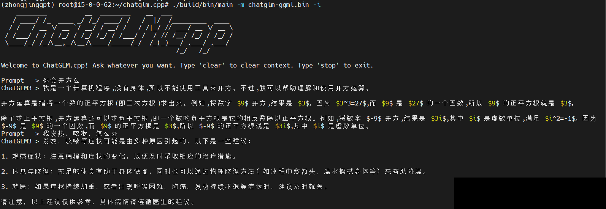

# LLM-on-Kunpeng920

LLM-on-Kunpeng920 is a comprehensive guide and toolkit for deploying and optimizing Large Language Models (LLMs) on the Huawei Kunpeng 920 platform. This project aims to provide developers and researchers with the necessary tools and knowledge to effectively utilize the Kunpeng 920's ARM-based architecture for LLM inference.

## Table of Contents

1. [Introduction](#introduction)
2. [Features](#features)
3. [Getting Started](#getting-started)
4. [Documentation](#documentation)
5. [Contributing](#contributing)
6. [License](#license)
7. [Acknowledgements](#acknowledgements)
8. [Citation](#citation)

## Introduction

The Huawei Kunpeng 920 is a high-performance ARM-based CPU processor designed for server workloads. This toolkit provides optimized methods for deploying various LLMs, including but not limited to ChatGLM, Baichuan, and Qwen, on this platform. Our goal is to maximize the performance of LLM inference while maintaining model accuracy.



## Features

- Detailed guides for system environment preparation
- Instructions for model conversion and quantization
- Optimized compilation procedures for various inference engines
- Deployment strategies and best practices
- Inference optimization techniques specific to Kunpeng 920
- Performance monitoring and troubleshooting guides

## Getting Started

To get started with LLM-on-Kunpeng920, follow these steps:

1. Clone the repository:
   ```
   git clone https://github.com/pariskang/LLM-on-Kunpeng920.git
   cd LLM-on-Kunpeng920
   ```

2. Follow the guides in the `docs` folder for detailed instructions on each step of the process.

## Documentation

Our documentation is divided into several key sections:

1. [System Environment Preparation](docs/system_environment.md)
2. [Necessary Dependencies and Tools](docs/Necessary_Dependencies_and_Tools.md)
3. [Setting Up Model Repositories](docs/Setting_Up_Model_Repositories.md)
4. [Model Conversion and Quantization](docs/Model_Conversion_and_Quantization.md)
5. [Inference](docs/Inference.md)
6. [Demo and Ngrok](docs/Demo_and_Ngrok.md)

Each document provides step-by-step instructions and best practices for its respective topic.

## Contributing

We welcome contributions to LLM-on-Kunpeng920! If you have suggestions for improvements or encounter any issues, please feel free to open an issue or submit a pull request.

Please read [CONTRIBUTING.md](CONTRIBUTING.md) for details on our code of conduct and the process for submitting pull requests.

## License

This project is licensed under the MIT License - see the [LICENSE.md](LICENSE.md) file for details.

## Acknowledgements

- Huawei for the Kunpeng 920 platform
- The developers of ChatGLM, Baichuan, and Qwen for their excellent LLM implementations
- Peng Cheng Laboratory for providing resources and support
- All contributors and users of this toolkit

## Citation

If you use LLM-on-Kunpeng920 in your research or project, please cite it as follows:

```bibtex
@misc{LLM-on-Kunpeng920,
  author = {Yanlan Kang},
  title = {LLM-on-Kunpeng920: Optimizing Large Language Models on Huawei Kunpeng 920},
  year = {2024},
  publisher = {GitHub},
  journal = {GitHub Repository},
  howpublished = {\url{https://github.com/pariskang/LLM-on-Kunpeng920}}
}
```
